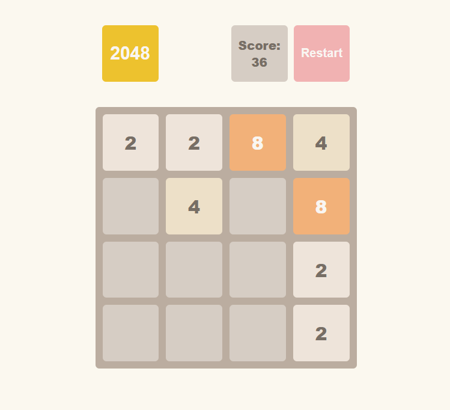

# 📱 game-2048

  

A classic, addictive puzzle game built with modern web technologies. Combine matching tiles to reach the legendary **2048** tile!

## 🚀 Live Demo
* **Live Website:** [View on Vercel](https://game-2048-woad-eta.vercel.app/)
---

## 🛠 Technologies & Tools

This project utilizes the following technologies:
* **HTML5 / CSS3** — Semantic and accessible markup structure.
* **JavaScript (ES6+)** — Interactive elements and dynamic behavior.
* **Sass (SCSS)** — Modular and convenient preprocessor styling.
* **Vite** — An ultra-fast build tool and local development server.
* **Vercel** — A reliable platform for fast deployment.

---
---

## 🛠 Technologies & Tools

This project utilizes the following technologies:
* **HTML5 / CSS3** — Structured and styled game board layout.
* **JavaScript (ES6+)** — Core game logic, state management, and keyboard event handling.
* **Sass (SCSS)** — Modular and maintainable styles.
* **Parcel** — Fast, zero-configuration web application bundler.
* **Vercel** — Reliable and fast cloud deployment platform.

---

## 🕹 How to Play
1. Use your **Arrow keys** (or swipe on mobile devices) to move the tiles.
2. When two tiles with the same number touch, they **merge into one**!
3. Keep playing until you reach the **2048 tile** (or higher).
